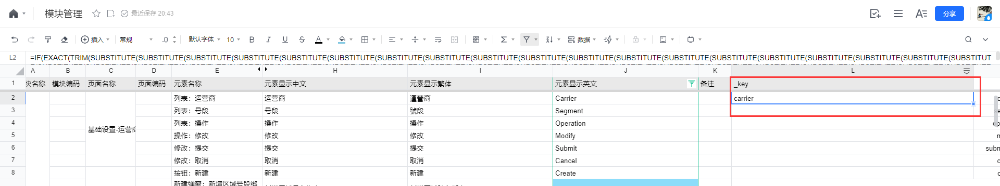
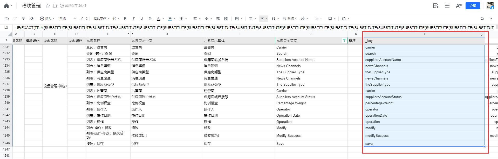
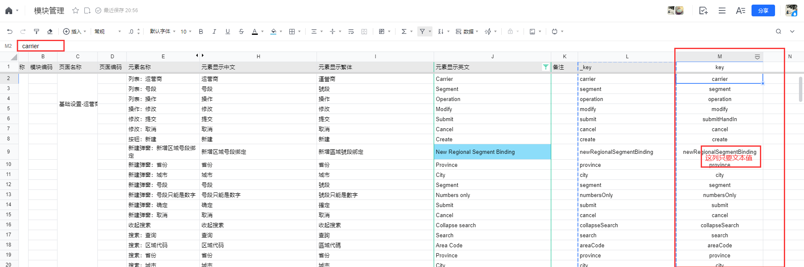
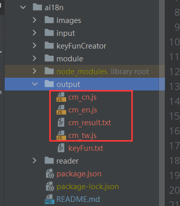
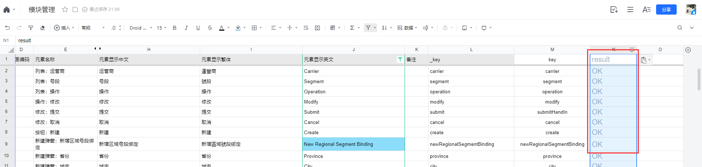

# i18n Tool

#2个主要工具：
1.keyFunCreator
  生成excel函数，此函数自动读取英文翻译生成key；
2.i18nReader
  读取excel某一表格的数据，并生成js文件；

#使用说明：
1. 安装依赖
npm install

2. 执行keyFunCreator.js
  2.1 执行成功会在output文件夹生成keyFun.txt
  2.2 将keyFun.txt的全部内容复制到excel里新一列_key的一个单元格(enCell变量同一行)回车
      
  2.3 选中刚才粘贴的单元格，拖动滚动条到底部，按住Shift键，点击最后一个单元格选中一整列，
      再按`Ctrl + D`，自动填充函数；
      
  2.4 将_key列复制并“仅粘贴值”到新一列key，作为初始key值（可调整一些值）；
      

3. 导出excel文档，并放到input文件夹下

4. 在module中新建一份对应的js文件（内容可复制cm.js），更改moduleName、sheetName变量；

5. 执行module中新建的js，就会在output中生成4（调整入参后会不一样）份文件；
   

6. 将其中名字有result那份文件的全部内容复制到excel的新一列，就可以知道每行的处理结果；
   
   result的含义如下：
     OK 行数据有效
     key + 数字后缀（数字前不带下划线） 表示key值重复，但是三种翻译有区别，可以考虑换个key
     （只有`OK`和`key+数字`这两种结果都会放到i18n文件中）
     Deleted 行的key以及三种翻译都重复
     Ignored 忽略的行（key值为空）
   注意：手动改key加数字后缀的话，数字前加个下划线跟代码自动加的区别开

7. 根据result调整key后从第3步开始重新生成i18n文件

8. 将output中的i18n文件放到项目里提交
